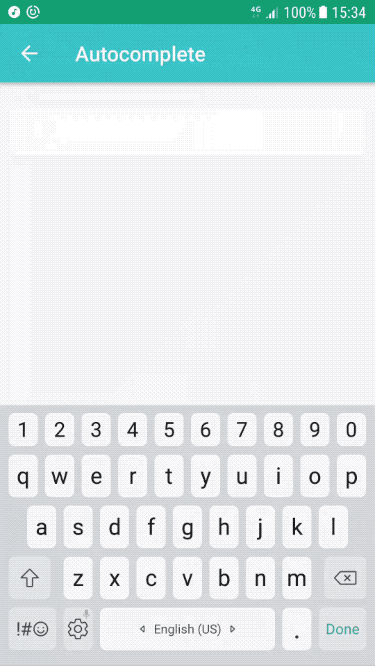
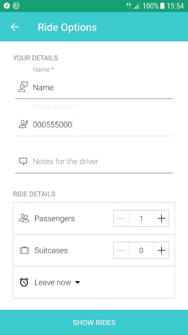
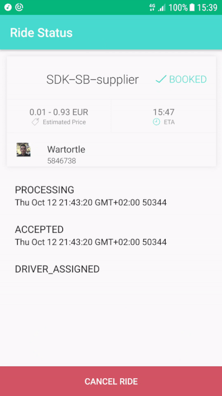

# HERE Mobility SDK Android - Sample App

## Introduction

HERE Mobility offers a mobility platform solution to transportation service providers, businesses, and consumers. The platform consists of the HERE Mobility Marketplace and SDK packages.

The HERE Mobility Marketplace is a "broker" between transportation suppliers and consumers, which matches up ride requests with ride offers. The HERE Mobility SDK enables developers to create apps with a variety of mobility features, while connecting to the HERE Mobility Marketplace.

The Here Mobility sample app (described below) presents a simple workflow for adding a variety of mobility services to your app.

This repository contains the Sample application showing the use of the [HERE Mobility SDK for Android](https://github.com/HereMobilityDevelopers/HERE-Mobility-SDK-Android).

## Getting Started

### Getting Access Credentials

To use the HERE Mobility SDK, you'll need App ID key and App secret key values.
To request these credentials, contact us at [mobility_developers@here.com]().

### Cloning the Sample App Git Repository

1.  Clone this repository.
2.  Replace App Key and App Secret in the `here_mobility_app_key.xml`.
3.  Open it in Android Studio and run the app.

## The Sample App

Here is an overview of the workflow for booking a ride and monitoring its progress, using the HERE Mobility SDK.
Click on a step name to go to its corresponding code example.

| Step                                                    | Description                                                |
| :------------------------------------------------------ | :--------------------------------------------------------- |
| [Forward geocoding](#forward-geocoding)                 | Retrieve the geo-location for an address or place name     |
| [Get the ride route](#get-ride-routes)                  | Get the ride's route, based on its start and end locations |
| [Get ride offers](#get-ride-offers)                     | Get ride offers from public or private ride suppliers      |
| [Book a ride](#book-a-ride)                             | Book one of the ride offers received                       |
| [Register for ride updates](#register-for-ride-updates) | Register for updates about the ride's progress             |

### Forward Geocoding

The HERE SDK Map Kit supports forward geocoding and reverse geocoding.
Forward geocoding is the conversion of a street address or place name to a geo-location (latitude/longitude pair).
Reverse geo-coding is the conversion of a geo-location (latitude/longitude pair) to addresses or place names near the given geo-location.



The following code snippet shows how to query for a geocoding result, based on a query string and location coordinates.

```java
//Create forward geocoding request.
GeocodingRequest geocodingRequest = GeocodingRequest.newForwardRequest(
        query,
        location, //The location around which to search for results.
        countryCode, //ISO 3166 alpha 3 country to code used filter results.
        languageCode, //ISO 639-1 language code for the preferred language of the results
        resultTypes); // The result types to obtain.

//send the request.
ResponseFuture<GeocodingResponse> autocompleteResponse =
		      autocompleteClient.geocode(geocodingRequest);

//register listener for updates.
autocompleteResponse.registerListener(geocodingResponseResponseListener);
```

### Get Ride Routes

In the HERE SDK Map Kit, routes are represented by "polylines", which are lines composed of multiple, connected straight-line segments. A route's polyline originates from the ride's start location and ends at the ride's destination location, optionally going through additional "waypoint" locations.

The following code snippet shows how to retrieve routes with the given start and end locations.

```java
//Initialize RouteClient.
RoutingClient routingClient = RoutingClient.newInstance(this);

//Request route calculation between pickup to destination.
  RouteRequest routeRequest = RouteRequest.create(pickup, destination);

//Route Request, register to updates listener.
  routingClient.
          requestRoute(routeRequest).
          registerListener(routeListener);
```

### Get Ride Offers

The HERE SDK Demand Kit allows you to request ride offers based on various parameters.



#### Create ride route based on pickup and destination locations

```java
//Initialize RouteClient.
RoutingClient routingClient = RoutingClient.newInstance(this);

//Request route calculation between pickup to destination.
  RouteRequest routeRequest = RouteRequest.create(pickup, destination);

//Route Request, register to updates listener.
  routingClient.
          requestRoute(routeRequest).
          registerListener(routeListener);
```

#### Get ride offers based on a ride request object

```java
//RideOffersRequest builder.
RideOffersRequest.Builder rideOfferBuilder = RideOffersRequest.builder()
        .setConstraints(bookingConstraints)
        .setRideWaypoints(rideWaypoints);

//set pre-book time, default is now.
if (preBookTime != null) {
    rideOfferBuilder.setPrebookPickupTime(preBookTime);
}

RideOffersRequest rideOffersRequest = rideOfferBuilder.build();

//Request ride offers.
ResponseFuture<List<RideOffer>> offersFuture = demandClient.getRideOffers(rideOffersRequest);

//Register offers future listener.
offersFuture.registerListener(rideOffersFutureListener);
```

#### Handle ride offers according to type

```java
offer.accept(new RideOffer.Visitor<Void>() {
            @Override
            public Void visit(@NonNull TaxiRideOffer taxiRideOffer) {
                //Use taxi ride offer.
                return null;
            }

            @Override
            public Void visit(@NonNull PublicTransportRideOffer publicTransportRideOffer) {
                //Use public transport ride offer
                return null;
            }
        });
```

### Book a Ride

Once you have a ride offer, you can book the ride.

#### Create passenger details object

```swift
PassengerDetails passengerDetails = PassengerDetails.builder()
                    .setName(name)
                    .setPhoneNumber(phone).build();
```

#### Book a ride based on a ride offer and passenger details

```java
CreateRideRequest.Builder rideRequest = CreateRideRequest
                            .builder(taxiRideOffer.getOfferId(), passengerDetails);

//Request to book a ride.
ResponseFuture<Ride> rideRequestFuture = demandClient.createRide(rideRequest.build());

//Register for ride request updates.
rideRequestFuture.registerListener(rideFutureListener);
```

#### Register for ride updates

The HERE SDK Demand Kit allows you register for updates on a ride's progress, including its status, location and ETA.



```java
DemandClient demandClient = DemandClient.newInstance(this);

DemandClient.RideUpdateListener listener = new DemandClient.RideUpdateListener() {
        @Override
        public void onRideStatusChanged(@NonNull Ride changedRide, @NonNull RideStatusLog rideStatusLog) {

        }
        @Override
        public void onRideLocationChanged(@NonNull Ride ride, @NonNull RideLocation rideLocation) {

        }
        @Override
        public void onErrorOccurred(@NonNull Throwable throwable) {

        }
    };

demandClient.registerToRideUpdates(rideId,listener);
```

## Support

To get help with the HERE Mobility SDK, contact our support team at [mobility_support@here.com](mailto:mobility_support@here.com)

## Licence

[http://www.apache.org/licenses/LICENSE-2.0](http://www.apache.org/licenses/LICENSE-2.0)
